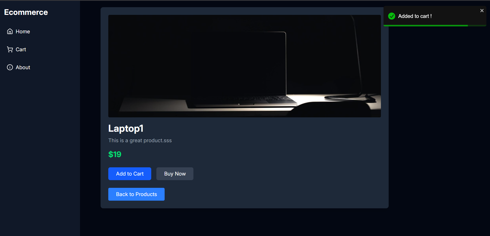

# Getting Started with ECommerce

<p align="center">
  <a href="" rel="noopener">
    


</p>
<p align="center">
    <br> 
</p>
<div align="center">

[](https://github.com/hamdy-cufe-eng/Ecommerce/contributors)
[](https://github.com/hamdy-cufe-eng/Ecommerce/issues)
[](https://github.com/hamdy-cufe-eng/Ecommerce/network)
[](https://github.com/hamdy-cufe-eng/Ecommerce/stargazers)
[](https://github.com/hamdy-cufe-eng/Ecommerce/blob/main/LICENSE)

</div>

<details>
  <summary>Table of Contents</summary>
  <ol>
    <li>
      <a href="#about">About The Project</a>
      <ul>
        <li><a href="#tech">Built Using</a></li>
      </ul>
    </li>
    <li>
      <a href="#install">Getting Started</a>
      <ul>
        <li><a href="#install">Installation</a></li>
      </ul>
    </li>
    <li><a href="#features">Features</a></li>
    <li><a href="#screenshots">Screenshots</a></li>
	<li><a href="#contributors">Contributors</a></li>
  </ol>
</details>


## About

 Advanced Ecommerce made in c# with a flat ui design .

## 💻 Built Using <a name = "tech"></a>
* 


## 🏁 Get Started /Usage <a name = "install"></a>
1. **Clone the repository**
```
git clone https://github.com/hamdy-cufe-eng/Ecommerce.git
```
2. **Install Visual Studio**


3. **Open the Projectlder in IDE**


- Restore packages
- 


## Getting Started

### Installation

Install the dependencies:

```bash
npm install
```

### Development

Start the development server with HMR:

```bash
npm run dev
```

Your application will be available at `http://localhost:5173`.

## Building for Production

Create a production build:

```bash
npm run build
```

## Deployment

### Docker Deployment

To build and run using Docker:

```bash
docker build -t my-app .

# Run the container
docker run -p 3000:3000 my-app
```
## 🎆 Features <a name = "features"></a>

- React toastify to display top right message on actions
- a loading spinner till page full loads
- Removing from carts and Abot/contact page
- ability to add multiple carts
- Responsive design 
- Add to cart and full page
- Sorting using (A-z , Z-a , Price , Input)
- TailWind CSS
- Routes to navigate between pages
- Modern Flat-UI 


## 📷 Screenshots <a name = "screenshots" ></a>

<div name="Screenshots" align="center">
   
   <hr>
    
    <hr>
  
   
   <hr>
   
   

   
   <hr>
      
   

   
   <hr>
</div>

## Contributors <a name = "contributors"></a>
<table align="center">
  <tr>
    <td align="center">
    <a href="https://github.com/hamdy-cufe-eng" target="_black">
    
    <br />
    <sub><b>Hamdy Ahmed</b></sub></a>
    </td>
    
  </tr>
 </table>

